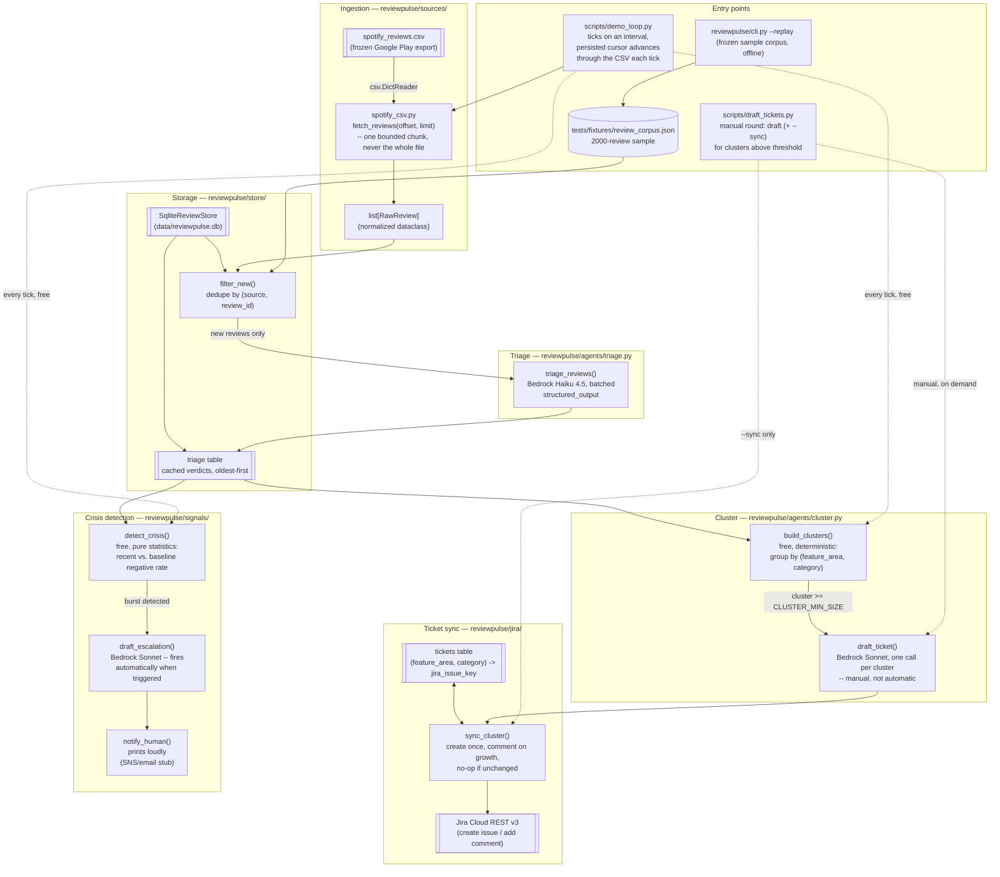

# ReviewPulse — Architecture

> **Status:** the full designed pipeline is built as of 2026-09-12 (ingest →
> dedupe → triage → cluster → ticket sync → crisis detection), verified
> end-to-end against real AWS Bedrock and a real Jira Cloud project. Only
> AWS deployment (EventBridge + AgentCore Runtime) remains. The final
> polished diagram for submission will be exported as
> `docs/architecture.png`.

## Currently implemented

### What each piece does

| Component | File | Responsibility |
|---|---|---|
| `ReviewSource` protocol | `reviewpulse/sources/base.py` | Common interface (`fetch(since) -> FetchResult`) so a second source is one new file, not a pipeline rewrite |
| Spotify CSV adapter | `reviewpulse/sources/spotify_csv.py` | Reads a frozen Google Play scraper CSV export and maps one bounded `[offset, offset+limit)` slice of rows to `RawReview` — stands in for a live, incrementally-polled source; there's deliberately no "load everything" call |
| `ReviewStore` protocol | `reviewpulse/store/base.py` | Same pattern — local SQLite now, swappable for DynamoDB at deploy time without touching pipeline code |
| SQLite store | `reviewpulse/store/sqlite_store.py` | Dedupes by `(source, source_review_id)`; caches triage verdicts keyed the same way, so a review is never classified twice; `triaged_rows()` returns them oldest-first, which crisis detection depends on |
| Triage | `reviewpulse/agents/triage.py` | Classifies each new review (sentiment, category, severity, feature_area) via Bedrock Haiku 4.5, batched (`TRIAGE_BATCH_SIZE`), one Bedrock call per batch |
| Cluster (grouping) | `reviewpulse/agents/cluster.py`: `build_clusters()` | Groups everything triaged so far by `(feature_area, category)`. Free — no LLM call — so it's safe to re-run every tick |
| Cluster (ticket draft) | `reviewpulse/agents/cluster.py`: `draft_ticket()` | For one cluster at/above `CLUSTER_MIN_SIZE`, drafts a title/description via Bedrock Sonnet. Deliberately manual, not auto-run on a schedule — mirrors the triage "manual round" philosophy |
| Ticket sync | `reviewpulse/jira/client.py`, `reviewpulse/jira/sync.py` | `JiraClient` (thin REST v3 wrapper: create issue, add comment) + `sync_cluster()`, which dedupes by `(feature_area, category)` against the store's `tickets` table — a cluster maps to exactly one Jira issue for the life of the local store; re-syncing comments with the delta or no-ops, never creates a duplicate |
| Crisis detection | `reviewpulse/signals/detector.py`: `detect_crisis()` | Pure statistics, no LLM: compares the negative-sentiment rate in the most recent `CRISIS_WINDOW_SIZE` triaged reviews against the baseline rate from everything before it. Free, safe to run every tick |
| Crisis escalation | `reviewpulse/signals/escalation.py`: `draft_escalation()`, `notify_human()` | When `detect_crisis()` triggers (rare by construction), Bedrock Sonnet drafts an internal alert + public holding statement automatically — unlike ticket drafting, this isn't deferred to a manual command, since a real crisis needs a human notified fast. `notify_human()` currently just prints loudly (stderr); the real SNS/email/Slack integration isn't built |
| Demo loop | `scripts/demo_loop.py` | Simulates a scheduled poll of a live source: ticks on an interval, persists a cursor (`data/demo_cursor.json`) across restarts, releases the next chunk, triages it, shows current clusters, and checks for a crisis — all free/local except the triage Bedrock call (and the rare crisis-escalation Bedrock call) |
| Manual ticket drafting/sync | `scripts/draft_tickets.py` | On-demand: draft tickets for every cluster at/above threshold; `--sync` also creates/updates the Jira issues (requires `JIRA_BASE_URL`/`JIRA_EMAIL`/`JIRA_API_TOKEN`/`JIRA_PROJECT_KEY`, loaded from `.env` via `python-dotenv`) |
| CLI | `reviewpulse/cli.py` | `--replay` (fixture) entry point, idempotent |
| Fixture corpus | `tests/fixtures/review_corpus.json` | 2000-review reproducible sample, built by `scripts/capture_fixtures.py` reading the CSV directly (a deliberate one-off full scan, unlike the adapter itself), used by `--replay`, tests, and (later) the demo video |

### Design notes

**Two-tier model routing, matching cost to volume:** triage runs Haiku 4.5 over every new review (the stage whose cost scales with volume); clustering's grouping step and crisis detection are both free (pure Python/math); only drafting a ticket or a crisis escalation — both low-volume, high-consequence — uses the pricier Sonnet model.

**Manual rounds for routine work, automatic for rare/urgent work:** `demo_loop.py`'s triage step and `draft_tickets.py`'s ticket drafting/sync are things you run deliberately, one Bedrock-call-batch (or one Jira write) at a time. Crisis escalation is the deliberate exception — it fires automatically the moment `detect_crisis()` trips, because by construction that should almost never happen, so the cost is negligible and speed to a human matters more than manual control.

**Dedup key doubles as the ticket key:** clustering groups by `(feature_area, category)`; the `tickets` table is keyed the same way. That's the whole dedup mechanism — no Jira-side search needed to find "does this cluster already have a ticket."

**Verified against real infrastructure, not just stubs:** unlike triage/cluster/ticket-sync's automated tests (all offline, stub agents/clients), a manual end-to-end pass confirmed real Bedrock triage, real Bedrock Sonnet ticket + escalation drafting, and real Jira issue creation/commenting against a live project (see `reviewpulse/config.py`'s docstring for the exact model IDs this AWS account needed).

---

## Not yet implemented

AWS deployment: EventBridge (real scheduled trigger, replacing `demo_loop.py`'s local polling loop) + AgentCore Runtime (hosting the pipeline), plus a real SNS/email/Slack channel behind `notify_human()` instead of a stderr print. This was always planned last, after the full local pipeline was verified end-to-end — which it now is.
